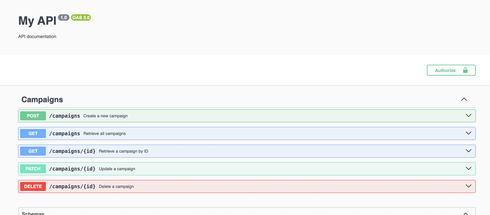

# README

## Tecnologias Utilizadas

- Node.js
- Docker
- Docker Compose
- npm
- Nest.js
- Postman
- PGAdmin

## Ambiente de produção

O app ja esta rodando na Cloud com uma DB, então caso queira pode fazer requests para la, são os endpoints:

- `GET https://mamba-production.up.railway.app/campaigns`
- `POST https://mamba-production.up.railway.app/campaigns`
- `GET https://mamba-production.up.railway.app/campaigns/:id`
- `PATCH https://mamba-production.up.railway.app/campaigns/:id`
- `DELETE https://mamba-production.up.railway.app/campaigns/:id`

## Configuração do Ambiente

1. **Clonar o repositório**:

   ```sh
   git clone https://github.com/guigateixeira/mamba.git
   ```

2. **Criar um arquivo `.env`** baseado no `.env.example` disponível no repositório:

   ```sh
   cp .env.example .env
   ```

3. **Subir os serviços com Docker Compose**:

   ```sh
   docker-compose up -d
   ```

4. **Instalar as dependências do projeto**:
   ```sh
   npm i
   ```

## Executando a Aplicação

Para rodar a aplicação em ambiente de desenvolvimento, use o seguinte comando:

```sh
npm run start
```

## Testes

Para rodar os testes unitarios, utilize:

```sh
npm run test
```

## Documentação

Quando o programa estiver correndo localmente pode entrar no url: `http://localhost:3000/api/docs` para aceder aos swagger docs:



## Endpoints

### Criar campanha

URL: `POST http://localhost:3000/campaigns`
body:

```
{
  "name": "Summer Giveaway",
  "category": "EMAIL",
  "startDate": "2024-07-01T00:00:00.000Z",
  "endDate": "2024-07-31T23:59:59.999Z"
}
```

### Pegar todas as campanhas

URL: `GET http://localhost:3000/campaigns?page=1`

### Pegar camapnha por ID

URL: `GET http://localhost:3000/campaigns/:id`

### Update de campanha

URL: `GET http://localhost:3000/campaigns/:id`
body:

```
{
  "name": string (OPTIONAL),
  "category": string (OPTIONAL),
  "startDate": date (OPTIONAL),
  "endDate": date (OPTIONAL),
  "status": string (OPTIONAL)
}

### Deletar campanha

URL: `DELETE http://localhost:3000/campaigns/:id`
```
